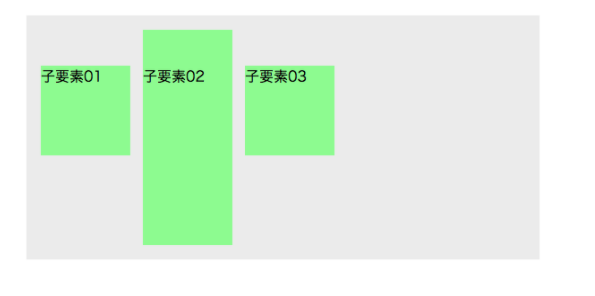
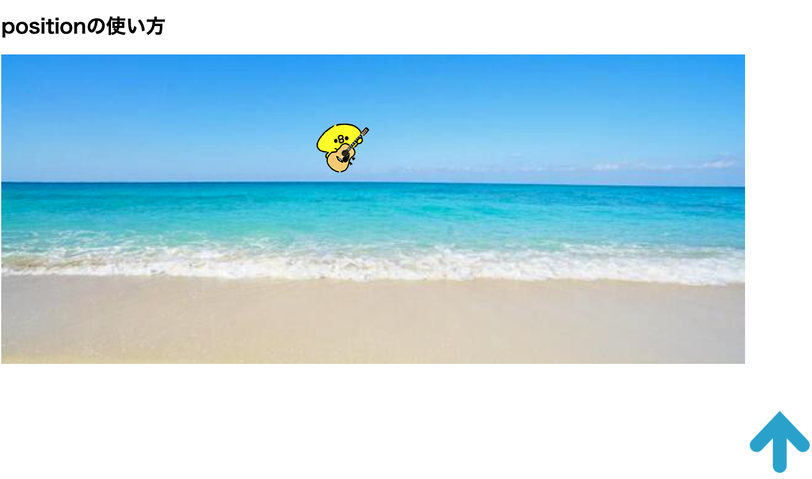

# レイアウト編

## flexboxについて


### 横並びレイアウト
<!---->


```
CSSので要素を並列にレイアウトするためには、displayプロパティの値にflexを指定します。

HTMLの多くの要素は初期値で上下に並びます。
そういった要素を左右に並べたい場合に、display:flexを利用します。
また横並びにしたい要素に直接指定するのではなく、指定したい要素の親要素に指定します。
（例：複数のli要素を横並びにしたい場合、親要素のul要素に指定する）

flex-start フレックスでレイアウトされたコンテンツの揃え位置を起点に指定。（通常、左端に配置 ）
flex-end フレックスでレイアウトされたコンテンツの揃え位置を終点に指定。（通常、右端に配置 ）
center フレックスコンテナの主軸の幅の中央揃え。通常、左右中央に配置。
space-between フレックスコンテナの主軸の幅に対し、余白を持った等間隔配置。
space-around フレックスコンテナの主軸の幅に対し、余白を持った等間隔配置。起点や終点の間にも間隔が発生する。

```

## flexレイアウト内の垂直軸方向におけるコンテンツの揃え位置



```
垂直軸方向におけるコンテンツの揃え位置を指定。（垂直方向におけるjustify-contentの様な役割）

center 　項目を中央付近に配置
flex-start 　フレックス項目を開始位置に配置
flex-end 　フレックス項目を終了位置に配置
baseline　フレックス項目を子要素のテキストのbaselineで合わせて配置
stretch　子要素の高さが揃った初期設定

```

サンプルコード
```
<!DOCTYPE html>
<html lang="en">
<head>
    <meta charset="UTF-8">
    <meta http-equiv="X-UA-Compatible" content="IE=edge">
    <meta name="viewport" content="width=device-width, initial-scale=1.0">
    <title>Document</title>
    <style>
        .block{
            width: 200px;
            height: 500px;
            background: aquamarine;
        }
        .wrap{
            width: 1500px;
            display: flex;

            /* 横列の配置 */
            justify-content: space-between;

            /* 上下の配置 */
            align-items: center;
        }
    </style>
</head>
<body>

    <h1>flexboxの使い方</h1>

    <div class="wrap">
        <div></div>
        <div></div>
        <div></div>
        <p class="block">ブロック</p>
    </div>
    
</body>
</html>
```


## positionの使い方



```

ボックスとボックスを重ねたり、画面の特定の位置に要素を固定するなど、marginやpadding、flexなどを使った通常のレイアウトでは配置できないような箇所に配置する際に利用する設定です。
基準となる要素の座標から、数値で座標位置を决めてレイアウトすることが可能です。


positionでは以下のキーワードで設定することができます。
relative　positionの基準位置を指定する設定です。
absolute position:relative;を基準とした絶対配置を行います。
fixed　画面の特定の位置に固定した状態で絶対配置します。


top
right
bottom
left
値の単位はpx, %などの指定が可能です。
```

サンプルコード
```

<!DOCTYPE html>
<html lang="en">
<head>
    <meta charset="UTF-8">
    <meta http-equiv="X-UA-Compatible" content="IE=edge">
    <meta name="viewport" content="width=device-width, initial-scale=1.0">
    <title>Document</title>
    <style>
        body{
            height: 3000px;
        }
        .wrap{
            width: 1200px;
            height: 500px;
            background: url("images/sea.jpg");
            background-size: cover;

            /* 起点にする*/
            position: relative;
        }

        .hiyoko{
            /* ポジションで相対配置 */
            position: absolute;
            top: 100px;
            left: 500px;
        }

        .arrow{
            position: fixed;
            right: 10px;
            bottom: 10px;
        }

    </style>
</head>
<body>

    <h1>positionの使い方</h1>

    <div class="wrap">
        <div class="hiyoko"></div>
        <div class="arrow"></div>
    </div>
    
</body>
</html>

```


<!--
## 擬似要素
```
content:'';
width:50px;
height:50px;
display:block;
でbackground-imageとかで使う

```
-->
